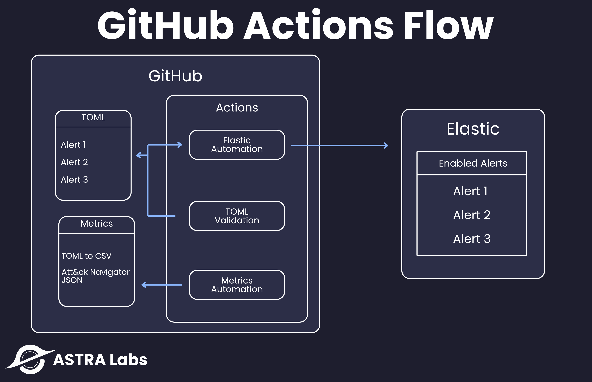

# Detection Engineering



> A modern, GitHub Actions–driven framework for managing and automating detection rules using TOML, with native integration into Elastic and automated validation pipelines.

---

## Overview

Detection Engineering is an automation-first approach to maintaining detection logic. It is designed for teams or individuals who want to:

- Build and validate detection rules in TOML
- Automatically push validated alerts to Elastic
- Generate metrics and ATT&CK Navigator layers
- Enforce consistent rule structure and CI/CD quality gates

This project uses **GitHub Actions** for continuous integration and deployment of detection content, built around the following core workflows:

---

## GitHub Actions Workflow

This repo uses GitHub Actions to automate:

- **Elastic Automation** – Push modified alerts directly into Elastic Security
- **TOML Validation** – Validate against required fields and MITRE ATT&CK accuracy
- **Metrics Automation** – Generate CSVs and MITRE Navigator JSONs from TOML

See the diagram above for full flow.

---

## Script Descriptions

### `mitre.py`

> **Purpose:** Validates detection rules against the MITRE ATT&CK framework  
> Checks:

- MITRE tactic names
- Technique and subtechnique IDs and names
- Deprecation status

### `update_alert.py`

> **Purpose:** Pushes updated TOML alerts to Elastic  
> Uses:

- Environment variable `CHANGED_FILES`
- Converts TOML → JSON and uses PUT or POST depending on rule ID presence

### `toml_to_json.py`

> **Purpose:** Full sync of all TOML detection rules into Elastic  
> Uploads all TOML alerts in the `/detections` directory to the Elastic Detection Engine.

### `validation.py`

> **Purpose:** Field validation for TOML alerts  
> Checks:

- Presence of required fields based on `required_fields.toml`
- Ensures `metadata.creation_date` is defined

---

## Workflows

| Workflow File                   | Trigger               | Description                                  |
| ------------------------------- | --------------------- | -------------------------------------------- |
| `all_detections_to_elastic.yml` | Manual / On push      | Push all TOML alerts to Elastic              |
| `elastic_sync.yml`              | On file change (TOML) | Sync only changed TOML files to Elastic      |
| `toml_mitre_validation.yml`     | On PR / push          | Validate MITRE tactics, techniques, subtechs |

---

## Outputs

- CSV detection metrics
- MITRE Navigator layers
- Validated TOML → JSON conversion for Elastic

---

## Elastic API Key Configuration

To store your Elastic API key securely:

1. Create a `.env` or `config.py` file and store your secrets (e.g., `API_KEY`)
2. Add that file to `.gitignore`:

   ```
   .env
   config.py
   ```

3. Load secrets using `os.environ` or similar at runtime

---

## Future Improvements

- Add enrichment with CTI context (e.g., threat actors, campaigns)
- Introduce coverage mapping vs. Sigma / ATT&CK matrix
- Continuous deployment into Elastic via CI/CD

---
